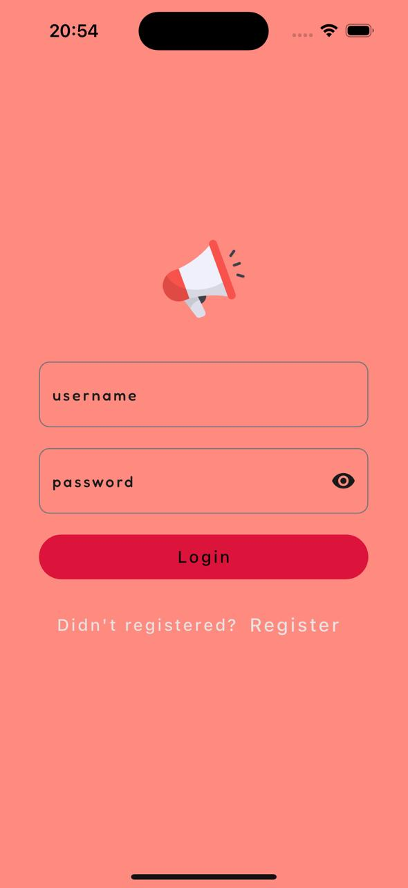
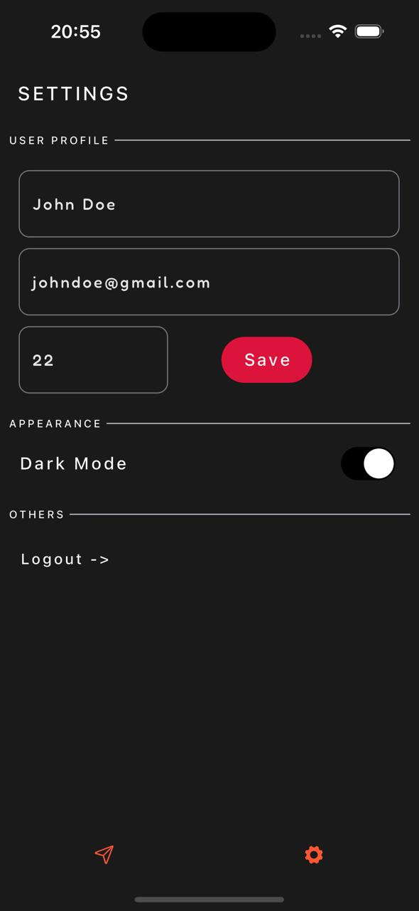
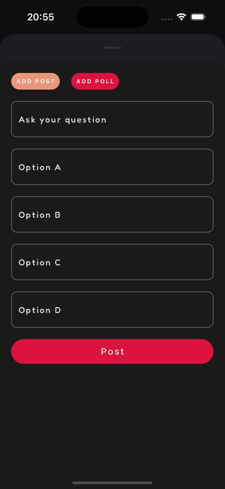

# LocalLoud

LocalLoud is a mobile application built with Flutter that allows users to participate in community-driven discussions and vote on various polls. It enables people to express their opinions on topics relevant to different communities.

## 📸 Screenshots

### Login | Home | Settings

<p align="center">
    
    
    
</p>

### Add Post | Add Vote Poll

<p align="center">
      
    
</p>

## ✨ Features

- 🗣 **Community-Based Discussions** - Engage in conversations on topics that matter to your community.
- 🗳 **Voting System** - Participate in polls and express your opinion.
- 🔒 **User Authentication** - Secure login and user authentication.
- 🎨 **Custom Themes** - Support for multiple themes.
- 💎 **Rich UI** - Uses Google Fonts and SVG assets for a polished user experience.

## 🛠 Tech Stack

- 🚀 **Framework**: Flutter
- 📦 **State Management**: Provider
- 🔌 **Networking**: Dio
- 💾 **Local Storage**: Shared Preferences

## 📂 Project Structure

```
📦 localloud
 ┣ 📂 assets
 ┃ ┗ 📄 (asset files - images, etc.)
 ┣ 📂 lib
 ┃ ┣ 📂 controller
 ┃ ┃ ┗ 📄 controller.dart
 ┃ ┣ 📂 models
 ┃ ┃ ┗ 📄 model.dart
 ┃ ┣ 📂 services
 ┃ ┃ ┗ 📄 service.dart
 ┃ ┣ 📂 utils
 ┃ ┃ ┣ 📂 constants
 ┃ ┃ ┣ 📂 routes
 ┃ ┃ ┣ 📂 themes
 ┃ ┃ ┗ 📄 util.dart
 ┃ ┣ 📂 views
 ┃ ┃ ┣ 📂 widgets
 ┃ ┃ ┗ 📄 view.dart
 ┃ ┗ 📄 main.dart
```

## 📦 Dependencies & Usage

The project uses the following Flutter packages:

```yaml
cupertino_icons: ^1.0.6 # 🍏 Provides Cupertino-styled icons for iOS-like UI.
provider: ^6.1.2 # 🏗 State management solution.
shared_preferences: ^2.2.3 # 💾 Stores small amounts of data locally.
flutter_svg: ^2.0.10+1 # 🎨 Supports rendering SVG images.
google_fonts: ^6.2.0 # ✍️ Allows using custom Google Fonts in the app.
dio: ^5.4.3+1 # 🌐 HTTP client for making API requests.
popover: ^0.3.0 # 🎭 Displays popover UI components.
```

## 🚀 Installation

1. Clone the repository:
   ```sh
   git clone https://github.com/yourusername/localloud.git
   cd localloud
   ```
2. Install dependencies:
   ```sh
   flutter pub get
   ```
3. Run the app:
   ```sh
   flutter run
   ```

## 📜 License

This project is licensed under the MIT License.

---

Feel free to contribute or report issues! 🚀
